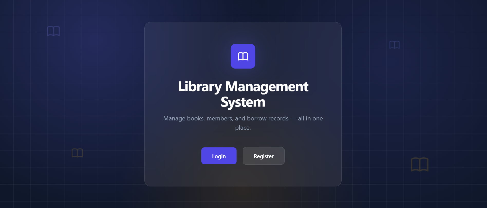
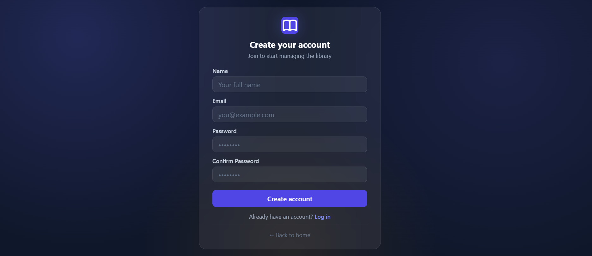
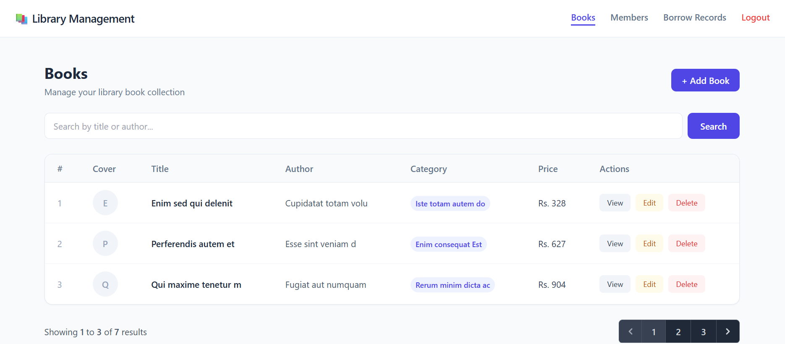
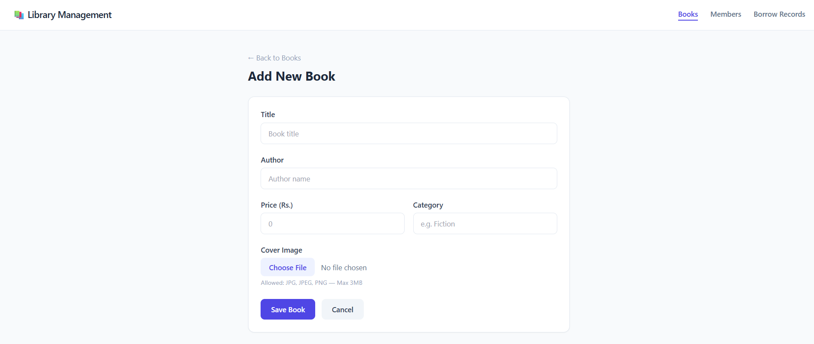
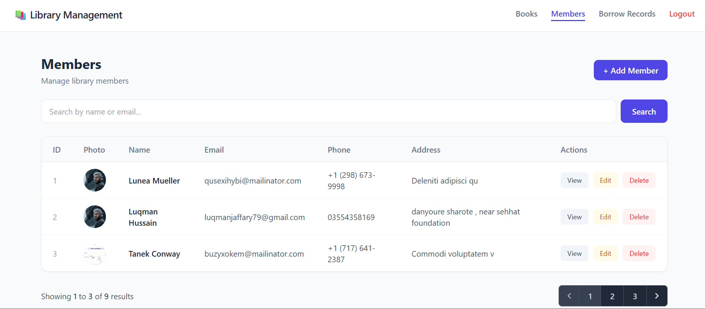
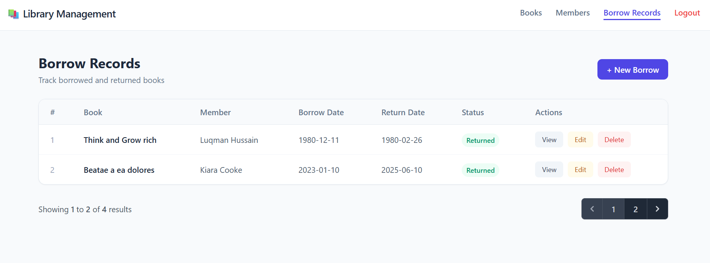

# 📚 Library Management System

A full-featured Library Management System built with **Laravel**, designed to manage books, members, and borrow/return records — complete with authentication, image uploads, search, pagination, and Eloquent relationships.

---

## Table of Contents

- [Features](#-features)
- [Tech Stack](#-tech-stack)
- [Modules](#-modules)
- [Installation](#️-installation)
- [Database Structure](#️-database-structure)
- [Relationships](#-relationships)
- [Screenshots](#-screenshots)
- [What I Learned](#-what-i-learned)
- [Future Improvements](#-future-improvements)

---

## 🚀 Features

- **Authentication** — Secure login & registration powered by Laravel Breeze
- **Books Management** — Create, read, update, delete books with cover image upload
- **Members Management** — Manage library members with photo upload
- **Borrow & Return Tracking** — Track which member borrowed which book, and when it was returned
- **Eloquent Relationships** — `hasMany` and `belongsTo` relationships between Books, Members, and Borrow Records
- **Image Upload** — Upload, update, and auto-delete old images on update
- **Search** — Search books and members instantly
- **Pagination** — Clean paginated listing for all modules
- **Custom UI/UX** — Tailwind CSS with custom delete confirmation modals and auto-dismissing success alerts
- **Form Validation** — Server-side validation with clear error messages
- **Protected Routes** — Middleware-guarded routes accessible only to logged-in users

---

## 🛠️ Tech Stack

| Layer | Technology |
|---|---|
| Backend | Laravel (PHP) |
| Database | MySQL |
| Frontend | Blade Templating + Tailwind CSS |
| Authentication | Laravel Breeze |
| Image Handling | Laravel File Storage |

---

## 📋 Modules

| Module | Description |
|---|---|
| **Books** | Title, Author, Price, Category, Cover Image |
| **Members** | Name, Email, Phone, Address, Photo |
| **Borrow Records** | Links Books & Members with Borrow/Return dates |

---

## ⚙️ Installation

**1. Clone the repository**
```bash
git clone https://github.com/your-username/library-management-laravel.git
cd library-management-laravel
```

**2. Install PHP dependencies**
```bash
composer install
```

**3. Install JS dependencies**
```bash
npm install
```

**4. Set up environment file**
```bash
cp .env.example .env
php artisan key:generate
```

**5. Configure your database in `.env`**
```env
DB_CONNECTION=mysql
DB_HOST=127.0.0.1
DB_PORT=3306
DB_DATABASE=library_management
DB_USERNAME=root
DB_PASSWORD=
```

**6. Run migrations**
```bash
php artisan migrate
```

**7. Start the servers** (two terminals needed)
```bash
# Terminal 1 — compiles CSS/JS
npm run dev

# Terminal 2 — runs the Laravel app
php artisan serve
```

**8. Open your browser**
```
http://127.0.0.1:8000
```

Register a new account to get started 🎉

---

## 🗄️ Database Structure

**Books Table**
`title`, `author`, `price`, `category`, `image`

**Members Table**
`name`, `email`, `phone`, `address`, `photo`

**Borrow Records Table**
`book_id` (foreign key), `member_id` (foreign key), `borrow_date`, `return_date`

---

## 🔗 Relationships

```php
// Book.php
public function borrowRecords()
{
    return $this->hasMany(BorrowRecord::class);
}

// Member.php
public function borrowRecords()
{
    return $this->hasMany(BorrowRecord::class);
}

// BorrowRecord.php
public function book()
{
    return $this->belongsTo(Book::class);
}

public function member()
{
    return $this->belongsTo(Member::class);
}
```

---

## 📸 Screenshots

| Welcome Page | Login |
|---|---|
|  |  |

| Books List | Add Book |
|---|---|
|  |  |

| Members List | Borrow Records |
|---|---|
|  |  |

---

## 🎯 What I Learned

- Building complete CRUD operations from scratch
- Working with Eloquent relationships (`hasMany`, `belongsTo`)
- Image upload, update, and deletion handling in Laravel
- Form validation and error handling
- Route naming conventions and resource controllers
- Pagination, eager loading, and search with `when()` clauses
- Implementing authentication with Laravel Breeze
- Protecting routes with middleware
- Building clean, responsive UI with Tailwind CSS
- Debugging real-world issues (redirects, route caching, path mismatches)

---

## 🔮 Future Improvements

- [ ] REST API with Laravel Sanctum authentication
- [ ] Dashboard with statistics (total books, members, active borrows)
- [ ] Email notifications for due returns
- [ ] Search and filter for borrow records

---

## 👤 Author

**Luqman**
Web Development Learner — building practical projects to become a senior Laravel developer.

---

## 📄 License

This project is open-sourced for learning purposes.
